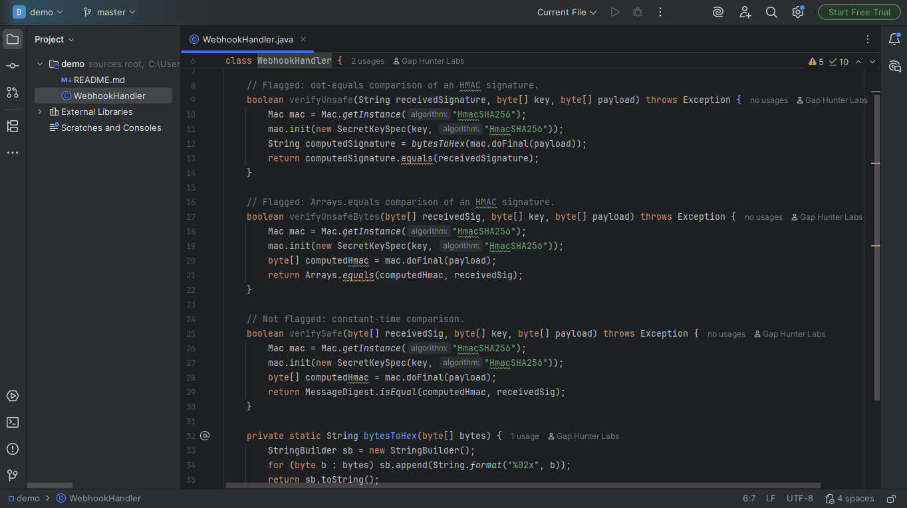

# JWT Webhook Signature Timing-Safe Comparison Companion

Warning on a webhook/HMAC signature comparison that uses `.equals()`/
`Arrays.equals()` (short-circuits on the first differing byte) instead
of `MessageDigest.isEqual(...)` (constant-time). An attacker can
reconstruct a valid HMAC signature byte-by-byte by measuring response
times, forging webhook events.

## Screenshots



## Why it exists

CWE-208 (Observable Timing Discrepancy) -- a documented, well-known
vulnerability pattern (Svix, Stripe-style HMAC guides, OWASP all cover
it explicitly). `webhook-signature-companion` (this catalog) verifies
that a signature-verification mechanism exists at all; this plugin
checks a different, deeper angle -- whether the comparison itself is
actually constant-time.

## Why built this way

- Flags the comparison site inside a method that itself computes an
  HMAC (`Mac.getInstance("Hmac...")`), so it never fires on an
  unrelated `.equals()` call elsewhere in the codebase.
- Recognizes signature-related identifiers by naming convention
  (`sig`/`hmac`/`hash`/`digest`/`mac` substrings), not real data-flow
  tracking -- keeps the mechanism simple and auditable, at the cost of
  needing conventional naming to fire.
- A method already using `MessageDigest.isEqual` anywhere in its body
  is assumed already safe and never flagged.

## v0.1 scope — stated honestly, not exhaustively

Only detects the pattern within the SAME method where both the HMAC
computation and the comparison happen -- never follows a signature
value passed to another method for comparison.

## Usage

Open any Java file. A method that computes an HMAC and then compares
the result via `.equals()`/`Arrays.equals()` against a signature-named
value shows a warning on the comparison call.

## Enterprise / Team Licensing

Need enterprise features, custom rules, or team licensing? Contact us at
**gaphunterlabs@gmail.com**.

## Development

```
./gradlew test           # unit tests
./gradlew buildPlugin    # generates build/distributions/*.zip
./gradlew verifyPlugin   # checks compatibility against real IDEs
```

## License

Apache-2.0. See `LICENSE`.
